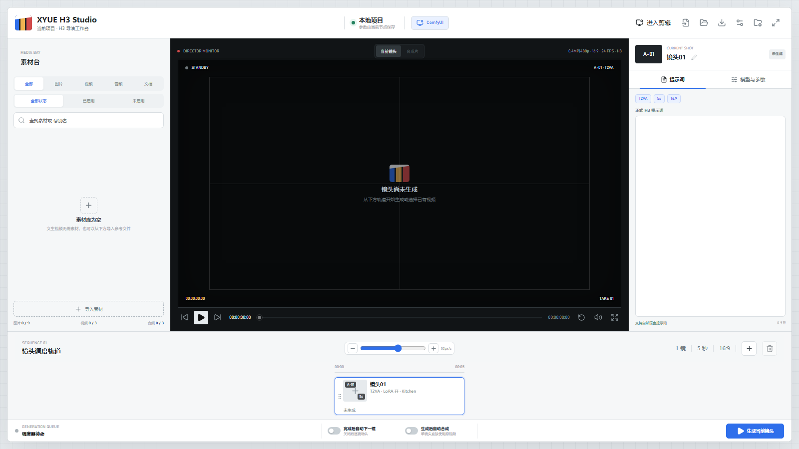

# ComfyUI-XYUE-H3-Studio

MiniMax H3 本地视频创作工作室。它把提示词、素材引用、H3 双段采样、镜头衔接、实时预览和剪辑导出集中在一个聚合界面中，适合制作单镜头和多镜头短剧。



## 功能概览

- **镜头轨道**：创建 1–5 个独立镜头。每个镜头可以单独编辑、生成、重试、保存和加入合成。
- **自然语言提示词**：直接输入 H3 自然语言提示词；在输入 `@` 或 `<` 时，可以从素材快速列表插入图片、视频和音频引用。
- **素材台**：读取 ComfyUI 的 input/output 素材，显示缩略图、名称、类型和启用状态。
- **镜头衔接**：普通切镜、承接上一镜尾帧、H3 Motion Context 动作与音频上下文。
- **双段精修**：基础 Sigma 调度、Sigma 尾段强化、第一次采样、视频 latent 放大、条件同步和第二次采样。
- **实时预览**：采样过程中通过 Tiny VAE 和 KJ Preview Override 查看中间画面。
- **剪辑页面**：独立二级页面支持预览、入点/出点、分割、复制、移除、排序、音量、静音和 FFmpeg 导出。
- **项目保存**：阶段视频、最终合成视频和报告 JSON 按项目目录保存，文件名支持模板和重名策略。

## H3 双段采样

每个镜头可以独立设置：

- 初始画面比例和 MP 分辨率
- 基础视频步数、基础音频步数
- Sigma 精修步数和降噪程度
- Latent 放大倍率（支持一位小数，例如 `1.4x`、`1.5x`、`1.6x`）
- 调度器、随机种子和参考素材尺寸策略

默认参数为基础视频 `4` 步、基础音频 `4` 步、Sigma 精修 `3` 步、降噪 `0.30`、Latent 放大 `1.5x`。H3 使用联合音画 latent，执行时以视频和音频步数中的较大值作为共享基础采样步数。

推荐的 16:9 起始方案是 `0.4MP（864×480）→ 1.5x → 1296×720`。执行顺序为：

```text
基础 Sigma 调度
→ Sigma 尾段强化
→ 分离高/低 Sigma
→ 第一次采样
→ 视频 latent 放大（音频 latent 保持原尺寸）
→ H3 Latent Cond Sync 条件同步
→ 第二次采样
→ 解码视频与音频
```

## 模型、LoRA 与注意力

每个镜头可以选择基础模型、多参考模型、语言模型、视频 VAE、音频 VAE、Latent 放大模型和 Tiny VAE，并单独设置：

- LoRA 开关
- LoRA 文件
- LoRA 强度
- `MiniMax H3 Kitchen Attention`
- `Patch Sol-Attn`
- 种子输入与模式：随机、增加、减少、固定；第一次生成后会保留实际使用的种子。

LoRA 会在主模型加载后应用，注意力后端随后接管模型注意力实现。Tiny VAE 只影响实时预览，不改变最终视频质量。

## 镜头衔接

- **普通切镜**：当前镜头独立生成，不读取上一镜。
- **承接上一镜尾帧**：自动取轨道上前一个镜头生成视频的最后一帧，作为当前镜头的衔接素材；生成模式由当前镜头选择决定。
- **Motion Context**：读取前一个镜头末尾的连续动作帧和原声音频，形成 H3 的动作与声音上下文。相邻镜头建议保持相同的初始比例和分辨率。

素材启用后会作为当前镜头的真实参考输入参与 Ref2VA。素材台支持 ComfyUI `input` 和 `output` 目录中的图片、视频、音频；输入 `@` 或 `<` 可以在光标附近打开快速引用列表。

当前镜头的“生成当前镜头”按钮只提交选中的镜头。已完成的其他镜头会保留；已有视频时按钮显示为“重新生成当前镜头”。种子输入框会保留第一次生成和最近一次生成的实际种子，模式可选随机、增加、减少或固定。

## 安装

在 ComfyUI 的 `custom_nodes` 目录执行：

```powershell
git clone https://github.com/MikuLXK/ComfyUI-XYUE-H3-Studio.git
```

安装插件依赖：

```powershell
python_embeded\python.exe -m pip install -r ComfyUI\custom_nodes\ComfyUI-XYUE-H3-Studio\requirements.txt
```

重启 ComfyUI 后，访问：

```text
http://127.0.0.1:8188/xyue-h3/studio/
```

也可以在 ComfyUI 画布中添加 `XYUE H3 Studio` 聚合节点。每次提交会按照当前项目配置生成对应的执行图。

## 第三方节点与模型

| 项目 | 用途 | 地址 |
| --- | --- | --- |
| Comfyui_Minimax_h3_latent_Upscaler | H3 3D latent 放大节点 | [GitHub](https://github.com/LBH-123-AI/Comfyui_Minimax_h3_latent_Upscaler) |
| Minimax_h3_latent_Upscaler | Latent 放大权重 | [Hugging Face](https://huggingface.co/LBH-123-AI/Minimax_h3_latent_Upscaler) |
| ComfyUI-H3-Motion-Context | 动作帧与原声音频衔接 | [GitHub](https://github.com/NikoDemon80/ComfyUI-H3-Motion-Context) |
| ComfyUI-SolAttn_triton | Patch Sol-Attn 注意力后端 | [GitHub](https://github.com/kijai/ComfyUI-SolAttn_triton) |
| ComfyUI-KJNodes | Tiny VAE 实时预览 | [GitHub](https://github.com/kijai/ComfyUI-KJNodes) |
| MiniMax H3 | 官方模型与提示词资料 | [GitHub](https://github.com/MiniMax-AI/MiniMax-H3) |

Latent 放大权重放入：

```text
ComfyUI/models/latent_upscale_models/
```

Tiny VAE 文件放入：

```text
ComfyUI/models/vae_approx/
```

## 项目与输出

保存设置支持项目名称、项目文件夹、阶段文件名模板、最终文件名模板和重名处理方式。默认输出位置：

```text
ComfyUI/output/xyue_h3/<项目名称>/
```

阶段视频、最终视频和执行报告会按当前项目设置分别保存。剪辑导出使用非破坏式流程，阶段源视频保持不变。

## 相关仓库

- [云端多段式 Skill](https://github.com/MikuLXK/h3-multi-stage-cloud-generation)
- [本地多段式 Skill](https://github.com/MikuLXK/h3-multi-stage-generation)
- [MiniMax H3 官方提示词资料](https://github.com/MiniMax-AI/MiniMax-H3)

## 验证

```powershell
python_embeded\python.exe -m compileall -q ComfyUI\custom_nodes\ComfyUI-XYUE-H3-Studio
python_embeded\python.exe -m pytest ComfyUI\custom_nodes\ComfyUI-XYUE-H3-Studio\tests -q --import-mode=importlib
```
